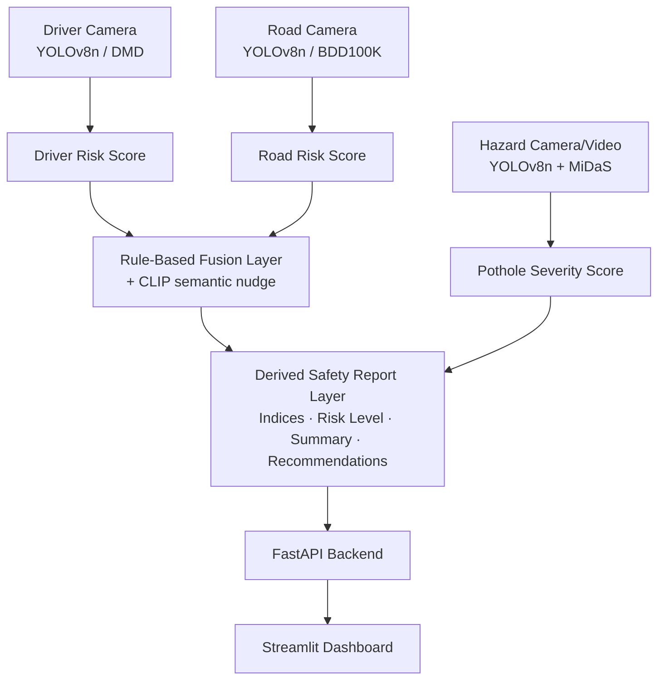

# VisionFusion

**A lightweight multimodal ADAS perception system** — fusing driver monitoring, road-scene understanding, and pothole hazard detection into a single real-time risk assessment pipeline.


Built end-to-end on free-tier, consumer hardware (RTX 3050 Laptop GPU, 4GB VRAM) — proof that a real, working ADAS-style perception system doesn't require a data center.

---

## Table of Contents

- [Overview](#overview)
- [Live Demo](#live-demo)
- [Architecture](#architecture)
- [Features](#features)
- [Results](#results)
- [Datasets](#datasets)
- [Tech Stack](#tech-stack)
- [Getting Started](#getting-started)
- [Honest Limitations](#honest-limitations)
- [Future Work](#future-work)

---

## Overview

VisionFusion simulates a lightweight in-vehicle sensor-fusion system by combining two independent perception streams — a **driver-facing camera** and a **road-facing camera** — into one unified risk assessment, alongside a dedicated **road-hazard module** for pothole detection and severity scoring.

Rather than a single monolithic model, VisionFusion deliberately uses **three independently-trained detectors** feeding into a rule-based fusion layer — a design choice made after validating that shared-backbone multi-task training causes gradient interference across dissimilar tasks (see [Architecture](#architecture)).

## Live Demo

**🔗 Live Demo:** [visionfusion-dashboard.onrender.com](https://visionfusion-dashboard.onrender.com) — interactive dashboard for driver-state + road-state + fusion, deployed free on Render. *(Free tier spins down after inactivity — first request may take 30-90s to wake up and run; occasional retries may be needed.)* Full pipeline including pothole detection, depth estimation, and video analysis runs locally — see [Getting Started](#getting-started).

| Driver State | Road State | Pothole Severity |
|---|---|---|
| Drowsiness / distraction detection | Vehicle / pedestrian detection | Depth-based severity scoring |

Run the full pipeline locally via the Streamlit dashboard — see [Getting Started](#getting-started).
## Architecture



**Design rationale:** each perception branch is trained and validated independently, with fusion happening only at the score level — not via a shared backbone. This was a deliberate decision after prior experience (see `EVALUATION.md`) showed that multi-task training across dissimilar inputs (e.g. driver faces vs. road scenes) causes gradient interference and degrades both tasks.

## Features

| Module | Capability |
|---|---|
| 🧑 Driver-State Detection | Classifies Safe / Distracted / Drowsy / Dangerous / Drinking / Yawning behavior |
| 🚗 Road-State Detection | Detects vehicles, pedestrians, riders, cyclists with proximity weighting |
| 🕳️ Pothole + Depth Severity | Detects potholes in images **or video**, estimates relative depth (MiDaS), scores Minor/Moderate/Severe |
| ⚡ Fusion Engine | Combines driver + road signals into one calibrated risk score |
| 📊 AI Safety Report | Derived Driver Safety Index, Road Health Index, overall risk level, natural-language summary, recommendations — zero extra models required |
| 🌐 REST API | FastAPI backend exposing all inference endpoints |
| 🖥️ Live Dashboard | Streamlit UI for all features, with annotated bounding-box visualization |

## Results

Full metrics, confusion matrices, and latency benchmarks in **[`EVALUATION.md`](./EVALUATION.md)**. Summary:

| Model | Metric | Score |
|---|---|---|
| Driver-State (DMD) | mAP50 | **0.978** |
| Road-State (BDD100K subset) | mAP50 | 0.317 |
| Pothole Detection | mAP50 / Precision | 0.779 / 0.867 |
| End-to-end pipeline | Latency (RTX 3050) | 65.16 ms (~15.3 FPS) |

## Datasets

| Dataset | Source | License |
|---|---|---|
| Driver monitoring | [DMD](https://universe.roboflow.com/driver-monitoring/dmd-tfiw0) | CC BY 4.0 |
| Road scene | [BDD100K subset](https://universe.roboflow.com/layout-3rcq8/bdd100k-axxue) | CC BY 4.0 |
| Pothole | [Pothole Object Detection Dataset](https://public.roboflow.com/object-detection/pothole) | ODbL v1.0 |

## Tech Stack

`PyTorch` · `Ultralytics YOLOv8` · `OpenAI CLIP` · `MiDaS` · `OpenCV` · `FastAPI` · `Streamlit` · `pytest` · `GitHub Actions`

## Getting Started

```bash
# clone and set up environment
git clone https://github.com/erajamurugan-s1011/VisionFusion.git
cd VisionFusion
python -m venv venv
venv\Scripts\activate        # Windows
pip install -r requirements.txt

# terminal 1 — start the API
cd src/api
uvicorn main:app --reload --port 8000

# terminal 2 — start the dashboard
cd src/dashboard
streamlit run app.py
```

Then open `http://localhost:8501` in your browser.

## Honest Limitations

Transparency matters more than a polished demo hiding rough edges:

- **Road-state model** is trained on a 4,000-image BDD100K subset, not the full 80K set — rare classes (bike, motor) have limited validation coverage and correspondingly weaker mAP. Full numbers in `EVALUATION.md`.
- **Pothole depth is relative**, not camera-calibrated — MiDaS gives monocular depth estimation without absolute scale, so severity scoring is an approximation, clearly labeled as such in the UI.
- **Fusion is rule-based**, not learned — no labeled risk-score dataset currently exists to supervise a trained fusion head.
- **DMD dataset split** has no session/subject metadata available, so train/validation leakage across driving sessions cannot be fully verified or ruled out.
- **Video pothole detection** samples frames independently with no object tracking — the same physical pothole may be counted more than once across multiple frames.

## Future Work

Planned extensions requiring dedicated datasets/training pipelines (deliberately out of scope for this version to keep it shippable): seatbelt detection, phone-usage detection, emotion/fatigue estimation, road crack classification, traffic sign detection, road surface/weather classification, lane detection, animal detection, traffic light state recognition, forward collision risk estimation.

---

*Built by [Erajamurugan S](https://github.com/erajamurugan-s1011) — B.E. CSE (AI & ML), PSG College of Technology.*
